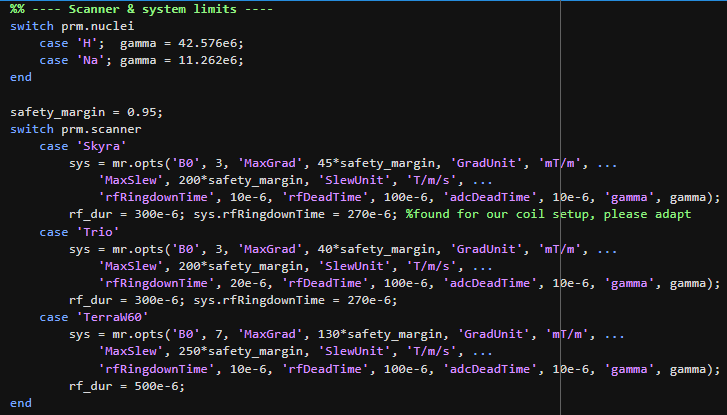

# TPI Pulseq Compiler and Reconstruction

Interactive Pulseq compiler and reconstruction pipeline for Twisted
Projection Imaging (TPI), targeting sodium (23Na) MRI with support for
proton (1H) acquisitions. Implements the constant-polar-angle cone
trajectory of Boada et al. (1997).

## Repository contents

- `TPI_UI.m` — interactive GUI: parameter entry, one-click compile,
  k-space/gradient/slew diagnostics, and .seq export.
- `tpi_compile_advanced.m` — compute-only sequence compiler consumed
  by the UI (no plotting side effects; returns a struct for programmatic use).
- `design_tpi_projection.m` — single-projection (radial ramp + twist +
  ramp-down) gradient waveform design for one cone.
- `calc_cone_distribution.m` — Nyquist-based ring/spoke distribution
  across the k-space sphere, with optional undersampling.
- `compute_slew_vs_cone_angle.m` — theoretical slew-rate sweep across
  all polar angles, used for hardware-feasibility diagnostics.
- `TPI_Recon.m` — example non-Cartesian reconstruction pipeline for TPI
  raw data (NUFFT gridding + density compensation, Hamming filtering).
- `utils/` — small standalone helpers used by `TPI_Recon.m`

## Dependencies

| Dependency | Purpose |
|---|---|
| [Pulseq for MATLAB](https://github.com/pulseq/pulseq) | Sequence design, gradient/ADC/RF construction, k-space calculation, and `.seq` export |
| [nufft_3d](https://github.com/marcsous/nufft_3d) | 3D non-uniform FFT used by `TPI_Recon.m` for gridding TPI k-space data |
| [mapVBVD](https://github.com/CIC-methods/FID-A) | Raw data loading (Siemens TWIX `.dat` format); bundled within the FID-A toolbox's `inputOutput` folder |
| MATLAB App Designer (`uifigure`, `uigridlayout`, etc.) | Required for `TPI_UI.m`; ships with MATLAB, no separate install |

## Usage

1. Launch `TPI_UI` in MATLAB with Pulseq on the path.
2. Set scanner, nucleus, geometry (FOV, matrix, TR), and TPI trajectory
   parameters (twist fraction `p`, `T_read`, ramp/transition modes).
3. Click **Calculate / Recompile** to run `tpi_compile_advanced` and
   inspect the k-space trajectory, one-TR gradient/ADC view, and the
   slew-rate-vs-cone-angle diagnostic.
4. Click **Save Sequence (.seq)...** to export the compiled Pulseq file.
5. Reconstruct raw data with `TPI_Recon.m`, which grids the compiled
   trajectory via `nufft_3d` and applies density compensation.
   NOTE: Be sure `nufft_3d` is on the path.

> ⚠️ **Safety notice:** Always verify SAR, gradient amplitude, slew rate, and
> duty cycle limits on your specific scanner before executing any sequence on
> hardware. This code is provided "as is" without warranty of any kind.

## Running without the GUI

`TPI_compiler.m` sets every parameter that `TPI_UI.m` would
normally collect through the interface and calls `tpi_compile_advanced.m`
directly. Use this for:
- machines without a display (remote/cluster jobs),
- scripted parameter sweeps (wrap the parameter block in a loop),
- reproducible, version-controlled protocol definitions.

Edit the parameter block at the top, then run the script; it saves the
compiled `.seq` file and (optionally) the k-space/slew diagnostic plots
to an `output/` folder. All `prm` fields match those documented in
`tpi_compile_advanced.m`'s header comment.

## Key trajectory parameters

| Parameter | Description |
|---|---|
| `p` | Twist onset fraction (`k0/kmax`); controls TPI scan-time efficiency vs. slew load |
| `Tread` | Target effective readout time, sets gradient amplitude `G_amp` |
| `ramp_mode` / `ramp_stretch` | Shape and duration margin of the Phase 1/3 \|G\| ramps |
| `transition_mode` / `transition_stretch` | Optional taper of angular velocity at the Phase 1→2 boundary to reduce slew spikes |
| `avoid_equator` | Excludes the exact equatorial ring (theta = 90 deg, odd NR) |
| `undersample_factor` | Additional ring/spoke undersampling beyond Nyquist |

## Add a new nuclei or scanner
Go to tpi_compile_advanced.m and you can find the following section right at the top. Just use your hardware limits to define a new 
scanner or add a new nuclei with the corresponding gyromagnetic ratio. The safty margin allows you to define how much of the potential 
hardware limit you want to work with.

  

## Reference

Boada FE, Gillen JS, Shen GX, Chang SY, Thulborn KR. Fast three
dimensional sodium imaging. Magn Reson Med. 1997;37(5):706-715.

## Citation

Jost V, Licht C, Zehender D, Zoellner F. A fully parametric open-source
Twisted Projection Imaging (TPI) implementation with Anatomically
Guided Reconstruction (AGR). In: Proceedings of the 2026 ISMRM Workshop
on Beyond Protons: Challenges and Advances in X-Nuclei MR, Barcelona,
Spain.

> **Note:** the undersampling factors published in the abstract will not apply to the current compiler version.

## License

Copyright (C) 2026 Valentin Jost

This program is free software: you can redistribute it and/or modify it under
the terms of the **GNU General Public License version 3** as published by the
Free Software Foundation.

This program is distributed in the hope that it will be useful, but **WITHOUT
ANY WARRANTY**; without even the implied warranty of MERCHANTABILITY or FITNESS
FOR A PARTICULAR PURPOSE. See the [GNU General Public License](https://www.gnu.org/licenses/gpl-3.0.en.html)
for more details.

**Note on dependencies:** [Pulseq](https://github.com/pulseq/pulseq) is
licensed under MIT, which is compatible with GPL-3.0. Any
derivative works that incorporate or modify code from this repository must
also be released under GPL-3.0.
